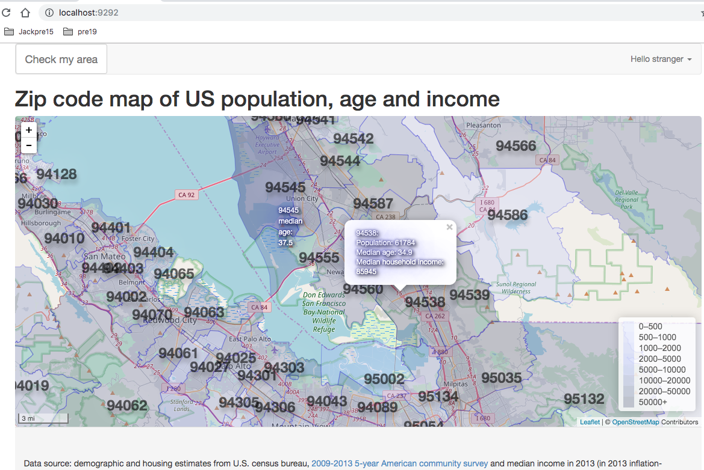

This is a personal practice of Leaflet GeoJSON Tile Layer serving by a remote Geoserver (AJAX/JSONP), based on bootstrap-ruby/sinatra-bootstrap.  Preparing for the US census data

To start it locally for example combined (calculated) data:

1. put untar/unziped shape files under current folder's `data/combine` folder
2. install geoserver and ensure ENABLE_JSONP is not comment out by editing its configuration file, such as /usr/local/Cellar/geoserver/2.13.2/libexec/webapps/geoserver/WEB-INF/web.xml
3. start geoserver by `geoserver /current/folder/`
4. follow [example of geoserver manual to setup and publish shape files with WFS enabled](https://docs.geoserver.org/stable/en/user/gettingstarted/shapefile-quickstart/index.html).
5. test [example call to geoserver](http://localhost:8080/geoserver/combine/ows?service=WFS&version=1.0.0&request=GetFeature&typeName=combine:combined&maxFeatures=200&outputFormat=text/javascript&format_options=callback:getJson&bbox=-122.42185592651367,37.78814921457968,-122.37293243408205,37.78828487531132&callback=getJson&_=1570290362142).
6. bundle install and `bundle exec rackup` to start sinatra, enjoy!